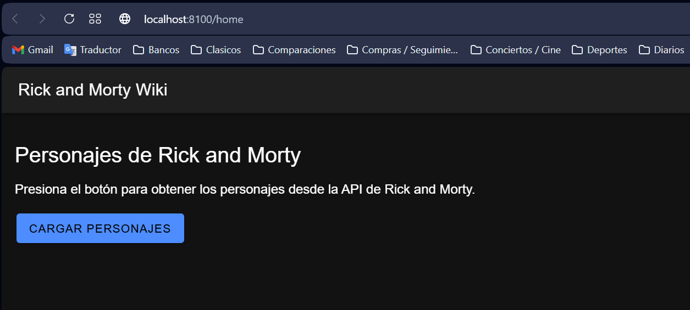
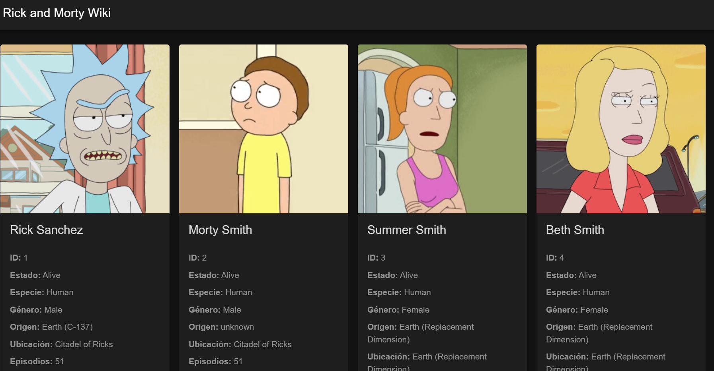

# Rick and Morty Wiki - Ionic + React

## Descripción

Aplicación web desarrollada con **Ionic + React** que consume la API pública de Rick and Morty para mostrar información de sus personajes en tarjetas.

API utilizada:

`https://rickandmortyapi.com/api/character`

## Proceso realizado

Se tomó como base el trabajo realizado en el Taller 4 de Ionic + React + APIs.

1. Se creó una interfaz `Character` con la estructura de los datos entregados por la API.
2. Se utilizaron estados de React mediante `useState` para almacenar personajes, estado de carga, errores y enlaces de paginación.
3. Se realizó la petición HTTP con `fetch()`.
4. La respuesta JSON se procesa utilizando `datos.results`, donde vienen los personajes.
5. Los personajes se muestran dinámicamente utilizando `map()` y componentes `IonCard` de Ionic.
6. Se agregó un indicador de carga mediante `IonSpinner` y manejo de errores.
7. Se utilizaron los campos `info.next` e `info.prev` de la API para navegar entre las páginas y poder consultar todos los personajes.

## Información mostrada

Para cada personaje se presenta:

- Imagen
- ID
- Nombre
- Estado
- Especie
- Género
- Tipo, cuando existe
- Origen
- Ubicación actual
- Cantidad de episodios en los que aparece

## Ejecución

Una vez dentro del proyecto Ionic:

```bash
npm install
ionic serve
```

Luego, en la aplicación, se debe presionar el botón **Cargar personajes**.

## Archivos principales

```text
src/
└── pages/
    ├── PostsPage.tsx
    └── PostsPage.css
```

## Capturas de pantalla

Antes de entregar el repositorio, guardar dos capturas dentro de una carpeta llamada `capturas` usando exactamente estos nombres:

```text
capturas/
├── vista-principal.png
└── personajes.png
```

Después de agregarlas, estas imágenes se mostrarán automáticamente en el README:

### Vista principal



### Personajes cargados



## Resultado

La aplicación permite consultar los personajes de Rick and Morty desde una API REST, visualizar sus datos de forma dinámica y desplazarse entre las distintas páginas de resultados.
